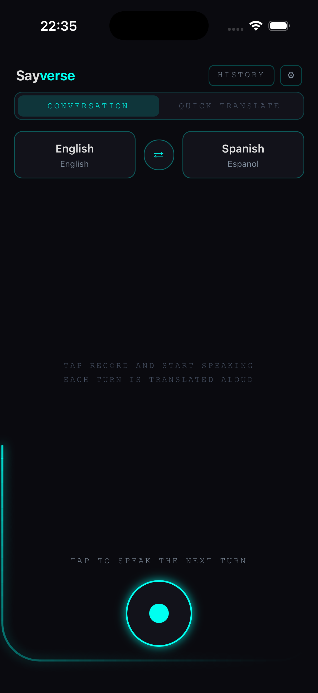
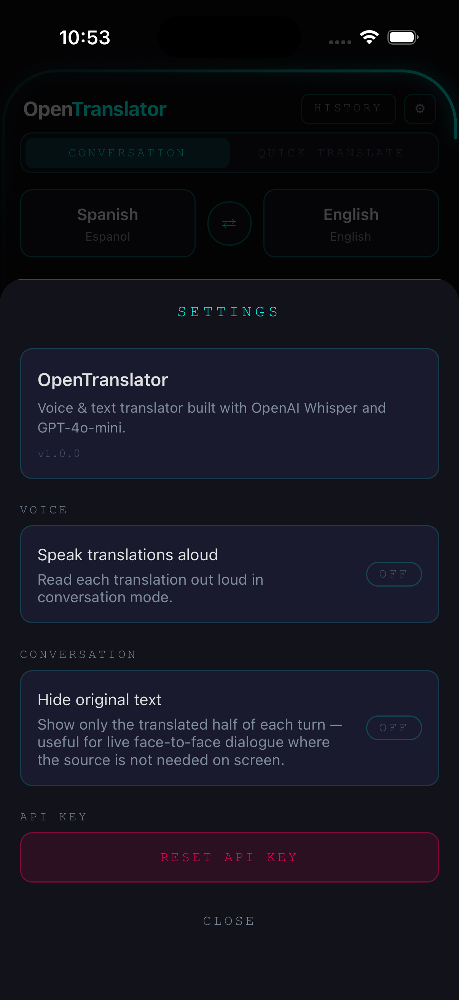

# OpenTranslator

[](https://github.com/ozadovskyi/OpenTranslator/actions/workflows/pr-checks.yml)
[](LICENSE)

A voice & text translator for live bilingual conversation, built with Expo /
React Native. Bring your own OpenAI key — there is no backend.

| Conversation mode | Settings |
|:-:|:-:|
|  |  |

## What it does

- **Single-shot** — type or speak a phrase and get the translation back, with
  speak-aloud playback.
- **Conversation** — bilingual turn-taking. Speak in either language; the app
  auto-detects which one, translates to the other, reads it aloud, and keeps a
  persisted history of the dialogue.

Translation runs on GPT-4o-mini, speech recognition on Whisper, and
text-to-speech on the device. The OpenAI API key is entered on-device and
stored locally — calls go straight from the device to OpenAI.

## Tech stack

- Expo SDK 55, React Native 0.83, React 19, TypeScript (strict)
- NativeWind v4, `react-native-reanimated`, `@shopify/react-native-skia` —
  a dark "Tron / neon" UI with a signature animated edge-line
- OpenAI GPT-4o-mini + Whisper; `expo-audio`, `expo-speech`

See [docs/architecture.md](./docs/architecture.md) for the full picture.

## Testing

Three layers, each with a distinct job:

- **Unit** (Jest) — pure logic: the conversation state machine, helpers.
- **Component** (Jest + React Native Testing Library) — UI flows driven through
  the assembled app on the real component tree; runs on every PR.
- **Native E2E** (Maestro) — the microphone voice path on an emulator.

A separate **LLM-evaluation** suite scores translation quality against the
live model (semantic similarity, an LLM judge, language detection).

Details: [docs/test-strategy.md](./docs/test-strategy.md) ·
[docs/llm-evaluation.md](./docs/llm-evaluation.md) ·
[docs/tradeoffs.md](./docs/tradeoffs.md)

## Quick start

```bash
npm install

# Run on a device — a development build is required (the app uses native
# modules beyond the Expo Go sandbox):
npx expo run:ios       # or: npx expo run:android
```

On first launch, paste an OpenAI API key (from
[platform.openai.com](https://platform.openai.com)). It is stored on the device
only.

## Scripts

| Script | What it does |
|---|---|
| `npm test` | Jest unit + component tests |
| `npm run test:watch` | Jest unit + component tests, watch mode |
| `npm run test:native` | Maestro native E2E (needs an emulator + an `e2e` build) |
| `npm run eval` | LLM-evaluation suite (needs `OPENAI_API_KEY`) |
| `npm run typecheck` | `tsc --noEmit` |
| `npm run lint` | ESLint + NativeWind class validation |

## License

MIT — see [LICENSE](LICENSE).

## Status

v1.0 — feature-complete, App Store submission pending.

---

Built by [Andrii Ozadovskyi](https://github.com/ozadovskyi).
